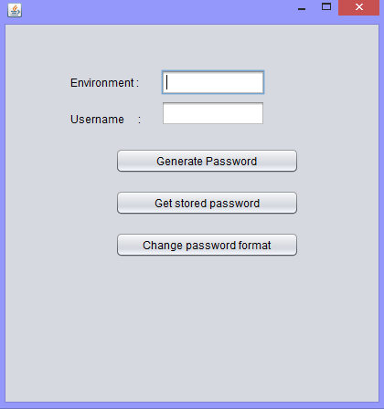
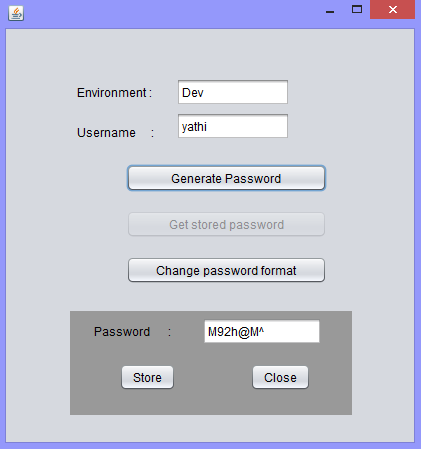
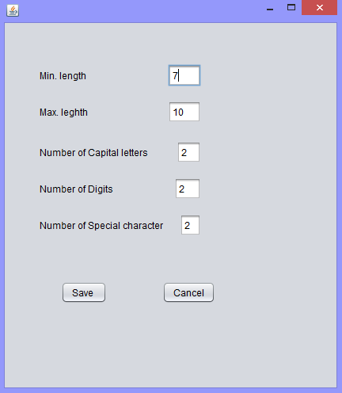

# Password Manager

Password manager is a java based desktop application which generates various combination of customized passwords and also enables user
to sotre and retrive it based on environment as a key.

To run the project from the command line, go to the dist folder and
type the following:

java -jar "PasswordGenerator.jar" 

## Few screens of the aplication

